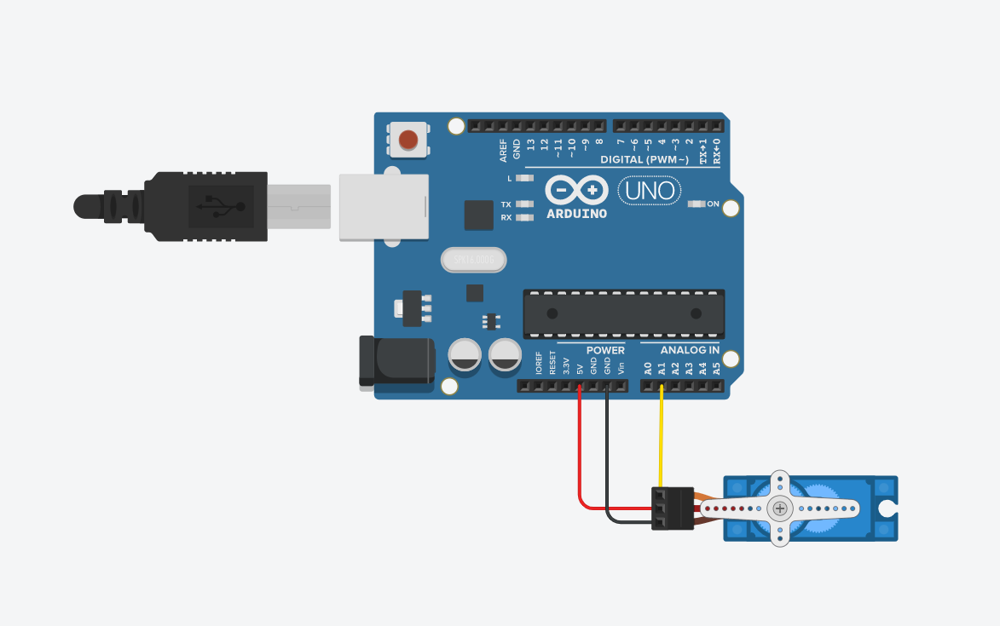
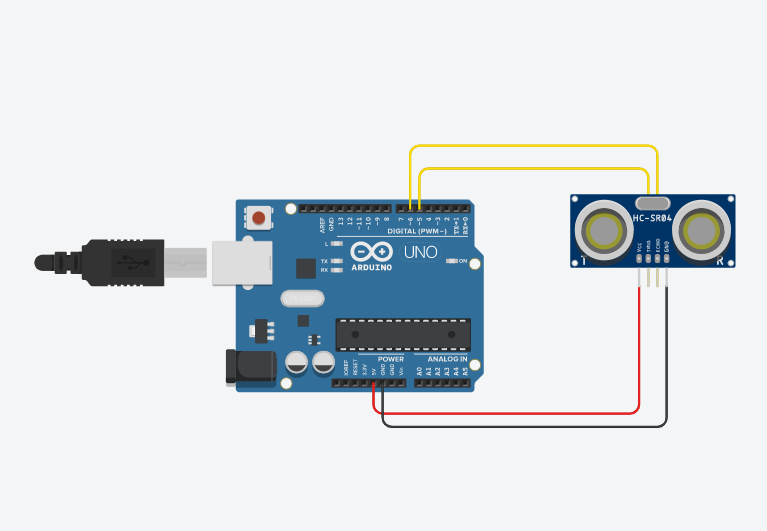

# CircuitPython

CircuitPython course module work

## Table of Contents
* [Hello_CircuitPython](#Hello_CircuitPython)
* [CircuitPython_Servo](#CircuitPython_Servo)
* [CircuitPython Distance Sensor](#CircuitPython_Distance_Sensor)

## Hello_CircuitPython

### Description & Code
The purpose of this assignment is to make an led built into a MetroExpress change colours using CircuitPython.

```python
import board
import neopixel
import time

dot = neopixel.NeoPixel(board.NEOPIXEL, 1)
dot.brightness = 0.2

print("make it rainbow!")

while True:
    dot.fill((255, 0, 0))
    time.sleep(0.5)
    dot.fill((255, 128, 0))
    time.sleep(0.5)
    dot.fill((255, 255, 0))
    time.sleep(0.5)
    dot.fill((0, 255, 0))
    time.sleep(0.5)
    dot.fill((0, 0, 255))
    time.sleep(0.5)
    dot.fill((255, 0, 255))
```


### Evidence


### Wiring
Only the board required!

### Reflection
This was a fairly basic assignment. I changed the assignment a little bit,to make the light shift between rainbow shades, using different colour codes for different colours.


## CircuitPython_Servo

### Description & Code

Make a servo turn

```python
import board
import time
import pwmio
from adafruit_motor import servo

pwm = pwmio.PWMOut(board.A2, duty_cycle=2 ** 15, frequency=50)

myServo = servo.Servo(pwm)

while True:
    for angle in range(0, 180, 5):
        myServo.angle = angle
        time.sleep(0.025)
    for angle in range(180, 0, 5):
        myServo.angle = angle
        time.sleep(0.025)
```

### Evidence


### Wiring


### Reflection
This assignment introduced ranges, which essentially circle a value in a specific range by a certain number, and expanded on CircuitPython syntax by introducing the key usage of servos, a small rotating motor.


## CircuitPython_Distance_Sensor

### Description & Code
This assignment uses the distance produced by an HC SR04, a type of ultrasonic distance sensor, to change the colour of an LED on board the Metro Express based on the distance. The closer to the sensor, the colour shifts to red, and the further away, the colour shifts to green. 

```python
# Lucy Gray, 17.09.21, Distance Sensor

import board
import time
import neopixel
import adafruit_hcsr04

led = neopixel.NeoPixel(board.NEOPIXEL, 1)
led.brightness = 0.2

sonar = adafruit_hcsr04.HCSR04(trigger_pin=board.D5, echo_pin=board.D6)

while True:
    try:
        dist = sonar.distance
        print((dist))
        if dist < 5:
            led.fill((255, 0, 0))
        if dist > 35:
            led.fill((0, 255, 0))
        if dist > 5 and dist < 20:
            r = (255 - ((dist-5)*(255/15)))
            b = 0
            g = (0 + ((dist-5)*(255/15)))
            led.fill((int(r), int(b), int(g)))
        if dist > 20 and dist < 35:
            r = 0
            b = (0 + ((dist-20)*(255/15)))
            g = (255 - ((dist-20)*(255/15)))
            led.fill((int(r), int(b), int(g)))
    except RuntimeError:
        print("Retrying!")
    time.sleep(0.1)
```

### Evidence


### Wiring


### Reflection
This assignment introduced the usage of an HC SR04 distance sensor to perform various functions with CircuitPython. 
