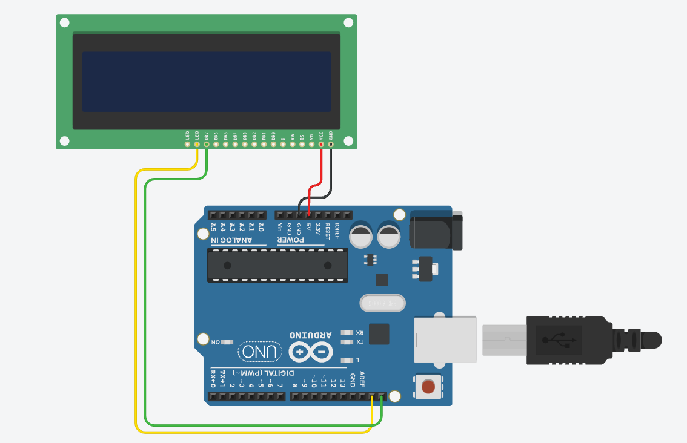

# CircuitPython

CircuitPython course module work

## Table of Contents
* [Hello_CircuitPython](#Hello_CircuitPython)
* [CircuitPython_Servo](#CircuitPython_Servo)
* [CircuitPython Distance Sensor](#CircuitPython_Distance_Sensor)
* [CircuitPython Photointerrupter](#CircuitPython_Photointerrupter)
* [CircuitPython LCD](#CircuitPython_LCD)

## Hello_CircuitPython

### Description & Code
The purpose of this assignment is to make an led built into a MetroExpress change colours using CircuitPython.

```python
import board
import neopixel
import time

dot = neopixel.NeoPixel(board.NEOPIXEL, 1)  # attach MetroExpress and led
dot.brightness = 0.2

print("make it rainbow!")

while True:  # makes the led change colours using colour codes 
    dot.fill((255, 0, 0))
    time.sleep(0.5)
    dot.fill((255, 128, 0))
    time.sleep(0.5)
    dot.fill((255, 255, 0))
    time.sleep(0.5)
    dot.fill((0, 255, 0))
    time.sleep(0.5)
    dot.fill((0, 0, 255))
    time.sleep(0.5)
    dot.fill((255, 0, 255))
```


### Evidence


### Wiring
Only the board required!

### Reflection
This was a fairly basic assignment. I changed the assignment a little bit,to make the light shift between rainbow shades, using different colour codes for different colours.


## CircuitPython_Servo

### Description & Code

Make a servo turn

```python
import board
import time
import pwmio
from adafruit_motor import servo

pwm = pwmio.PWMOut(board.A2, duty_cycle=2 ** 15, frequency=50)  # set pwm pin

myServo = servo.Servo(pwm)

while True:
    for angle in range(0, 180, 5):  # range between 0 & 180, add 5
        myServo.angle = angle
        time.sleep(0.025)
    for angle in range(180, 0, 5): # other way (180 - 0)
        myServo.angle = angle
        time.sleep(0.025)
```

### Evidence


### Wiring


### Reflection
This assignment introduced ranges, which essentially circle a value in a specific range by a certain number, and expanded on CircuitPython syntax by introducing the key usage of servos, a small rotating motor.


## CircuitPython_Distance_Sensor

### Description & Code
This assignment uses the distance produced by an HC SR04, a type of ultrasonic distance sensor, to change the colour of an LED on board the Metro Express based on the distance. The closer to the sensor, the colour shifts to red, and the further away, the colour shifts to green. 

```python
# Lucy Gray, 17.09.21, Distance Sensor

import board
import time
import neopixel
import adafruit_hcsr04

led = neopixel.NeoPixel(board.NEOPIXEL, 1)  # led
led.brightness = 0.2

sonar = adafruit_hcsr04.HCSR04(trigger_pin=board.D5, echo_pin=board.D6)  # attach distance sensor

while True:
    try:
        dist = sonar.distance
        print((dist))
        if dist < 5:  # if the distance is less than 5, light is red
            led.fill((255, 0, 0))
        if dist > 35:  # if distance is greater than 35, light is green
            led.fill((0, 255, 0))
        if dist > 5 and dist < 20:  # from red to blue
            r = (255 - ((dist-5)*(255/15)))
            b = 0
            g = (0 + ((dist-5)*(255/15)))
            led.fill((int(r), int(b), int(g)))
        if dist > 20 and dist < 35:  # from blue to green
            r = 0
            b = (0 + ((dist-20)*(255/15)))
            g = (255 - ((dist-20)*(255/15)))
            led.fill((int(r), int(b), int(g)))
    except RuntimeError:
        print("Retrying!")  #error in HCSR04
    time.sleep(0.1)
```

### Evidence


### Wiring


### Reflection
This assignment introduced the usage of an HC SR04 distance sensor to perform various functions with CircuitPython. 


## CircuitPython_Photointerrupter

### Description & Code
Using the digitalio library to use the pin connection as a resistor in order to detect a change in the state of the pin connecting it to the photointerrupter, this code is used to tell when a photointerrupter is interupted and count how many times this happens. By using the digitalio library, the pin is held at logic voltage, a high state, and switches to a low state when the photointerrupter is intrrupted. The counter is printed to the serial monitor every 4 seconds using time.monotonic().

```python
# photointerrupter, L.G. 24.09.21

import time
import digitalio
import board

initial = time.monotonic()  #set initial time

resistorPin = digitalio.DigitalInOut(board.D7) 
resistorPin.direction = digitalio.Direction.INPUT
resistorPin.pull = digitalio.Pull.UP
# define resistor pin for photointerruptor - uses board as resistor

counter = 0  # counts # of times photointerruptor interrupted

val = False  # store value of resistorPin
state = False  # store state (LOW/HIGH) of resistorPin

while True:
    val = resistorPin.value
    if val and not state:
        counter += 1  # add one to counter when state change detected
    state = val

    now = time.monotonic()  # sets current time
    if now - initial >= 4:
        print("I have been interrupted", str(counter), "times")
        initial = now  # resets initial to current (counting to 4 again)
    time.sleep(0.1)
```

### Evidence


### Wiring


### Reflection
This assignment introduced a bunch of new functions. I used [this site](https://github.com/gventre04/CircuitPython) for guidance, and modified it to fit the assignment. 

## CircuitPython_LCD

### Description & Code
This assignment was to use an LCD screen to display the value of a counter, and use capacitive touch - where touching a wire is detected to perform a function - both to increase the counter and to reverse the direction the counter is counting in (using different wires), then print this information to the screen as well.

```python
# LCD, Lucy G 01.10.21

import board
from lcd.lcd import LCD  # weird lcd library thing
from lcd.i2c_pcf8574_interface import I2CPCF8574Interface
import time
import touchio

i2c = board.I2C()
lcd = LCD(I2CPCF8574Interface(i2c, 0x3f), num_rows=2, num_cols=16)

touch_A5 = touchio.TouchIn(board.A5)
touch_A0 = touchio.TouchIn(board.A0)

counter = 0  # set counter value to zero
reverse=1 # reverse value

lcd.print("on")
while True:
    if touch_A5.value:
        counter+=reverse
        lcd.set_cursor_pos(0,0)  # set the cursor to the first row, first column
        if reverse==1:  # when reverse is pos (going up)
            lcd.print("Up: ")
        else:
            lcd.print("Down: ")
        lcd.print(str(counter))  # print the counter
        lcd.print("   ")  # give it some space
        while touch_A5.value:
            time.sleep(.01)  # idk this is j's thing

    if touch_A0.value:
        reverse=-reverse  # negative (down)
        while touch_A0.value:
            time.sleep(.1)
        lcd.clear()
        if reverse==1:
            lcd.print("Up: ")
        else:
            lcd.print("Down: ")
        lcd.print(str(counter))
```

### Evidence


### Wiring

_note: the LCD should have more wiring, with the SDA and SCL pins connected to their equivalently named MetroExpress pins, but the backpack is not shown in Tinkercad. Additionally, there should be a pin in A0 and A5 for capacitive touch._

### Reflection
For this assignment, I collaborated with Jay for some of the code, but essentially, the code adds value to the counter when a certain wire is touched, and when the reverse wire is touched, reverses the sign of the counter. I learned that lcd.clear() is fine but not great, and in order to solve the problem of it continuing to print, lcd.set_cursor_pos(0,0) is much better (this sets the cursor to the first row and column). 
